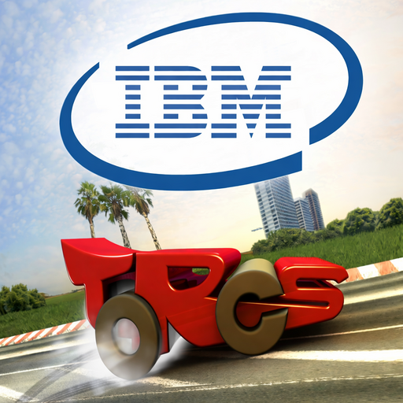

# TORCS AI Race-car and Editor With IBM
<div align="center">



</div>

# Background
IBM is a global technology company known for its enterprise hardware, software, cloud computing, and AI solutions.
In this project, we will be working with IBM and participating in their AI Race League. This tournament is designed to showcase how teams can build practical AI systems, communicate their development process clearly, and demonstrate their iterative development.

# Description
Our objective is to create an AI race-car driver in TORCS (The Open Racing Car Simulator) using a Python client server interface. TORCS itself provides real-time sensor telemetry and our Python driver must convert these signals into control commands (steering, throttle, break, gear) to successfully complete laps as fast as possible. Additionally, we hope to build an editor for TORCS that allows for easier customisation of assets inside the simulator.

Read about our devolpment process over at our [blog](https://medium.com/@conboyst/from-first-steps-to-first-finish-building-our-ai-racing-agent-in-torcs-68a0912e8579).

# The Team
## Third Years
- Ada Eriobu
- Jia Hao Yu
- Mark Varghese

## Second Years
- Evan Woods
- Odhran Curran
- Oliwia Kedzierska
- Samuel Kelly
- Stephen Conboy

# Getting Started
## Run AI driver
```bash
cd ml_driver
pip install -r requirements.txt
python evaluate.py
```

## Run TORCS Editor
```bash
cd branding_app
pip install -r requirements.txt
python app.py
```